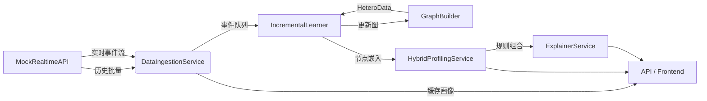

# 用户画像系统架构解析

## 1. 系统概览

用户画像系统由 **Flask 后端** 与 **Streamlit 前端** 组成，采用模拟实时数据源驱动的异构图 + 规则引擎混合策略，支持实时画像、策略推荐以及可解释性分析。

整体运行流程：

1. **数据层**：通过 `MockRealtimeAPI` 生成及加载用户、产品、应用基础数据与历史事件；实时事件不断产出。
2. **摄取层**：`DataIngestionService` 负责预加载用户画像、持续消费实时事件、维护轻量缓存，并以队列方式投喂增量学习模块。
3. **图构建 & 模型层**：`GraphBuilder` + `HeteroFeatureEncoder` 构建异构图及节点特征；`HGTModel` 对图执行嵌入计算，`IncrementalLearner` 基于事件驱动实现增量更新。
4. **融合画像层**：`HybridProfilingService` 同时调用规则引擎与 GNN 嵌入，通过门控融合得到最终画像得分；`ExplainerService` 使用 SHAP 对决策进行解释。
5. **接口层**：Flask 暴露查询、推荐、规则管理、全量刷新等 REST API；Streamlit 前端调用这些接口提供交互式控制台。

下文依组件详细说明。

## 2. 后端架构

### 2.1 `app/main.py`

- **初始化流程**：
  - 强制检查 GPU（CUDA）可用性，确保深度模型运行在 GPU 上。
  - 构建 `MockRealtimeAPI`、`DataIngestionService`、`RuleStore`、`RuleEngine`。
  - 构建 `GraphBuilder` 并加载离线快照生成初始异构图；基于图生成 `HeteroFeatureEncoder`。
  - 创建 `HGTModel` 与 `IncrementalLearner`，并加载初始图到增量学习器。
  - 实例化 `HybridProfilingService`（融合规则 + 嵌入）与 `ExplainerService`（SHAP 解释）。
  - 组装 `SystemController`，集中管理摄取、增量循环、图刷新与训练任务。
- **应用生命周期**：
  - 由Flask应用工厂`create_app`初始化，所有核心服务注入`app.config`，生命周期管理由`SystemController`负责。
- **全局状态注入**：将核心服务及 `SystemController` 放入 `app.config`，供蓝图依赖获取。
- **健康检查**：`/health` 聚合 `SystemController` 汇报的摄取与增量循环状态，包含运行态、事件积压、时间戳等指标。

### 2.2 API 层 `app/api/profiling.py`

主要路由（Flask蓝图）：

| 路径 | 功能 | 依赖服务 |
| --- | --- | --- |
| `GET /api/v1/user/<user_id>` | 返回用户基础画像（静态属性 + 行为统计） | `DataIngestionService`
| `GET /api/v1/recommendation/<user_id>` | 返回规则化策略推荐 | `DataIngestionService`
| `GET /api/v1/explain/<user_id>` | 返回混合画像得分及 SHAP 解释 | `ExplainerService`
| `GET /api/v1/rules` | 列出当前规则 | `RuleEngine`
| `POST /api/v1/rules` | 新增规则，后续刷新融合层与解释缓存 | `RuleEngine` + `HybridProfilingService` + `ExplainerService`
| `PUT /api/v1/rules/<name>` | 更新规则并刷新模型 | 同上 |
| `DELETE /api/v1/rules/<name>` | 删除规则并刷新模型 | 同上 |
| `POST /api/v1/graph/refresh` | 触发全量/采样图重建、可选重新训练 HGT + 融合层 | `SystemController` → `RefreshOrchestrator`

此外，为了赋能手动控制，新增一组运维端点：

| 路径 | 功能 | 依赖服务 |
| --- | --- | --- |
| `GET /api/v1/operations/status` | 汇总摄取、增量循环与任务历史状态 | `SystemController`
| `POST /api/v1/operations/ingestion/start` | 启动数据摄取服务 | `SystemController`
| `POST /api/v1/operations/ingestion/stop` | 停止数据摄取服务 | `SystemController`
| `POST /api/v1/operations/incremental/start` | 启动增量学习循环 | `SystemController`
| `POST /api/v1/operations/incremental/stop` | 停止增量学习循环 | `SystemController`
| `POST /api/v1/operations/fusion/train` | 手动训练融合核心（可调样本/轮次/学习率） | `SystemController` → `HybridProfilingService`
| `POST /api/v1/operations/rules/refresh` | 重建规则结构并清空解释缓存 | `SystemController`
| `POST /api/v1/operations/explainer/clear` | 单独清空解释器缓存 | `SystemController`
| `POST /api/v1/operations/shutdown` | 显式释放资源（停止后台任务并关闭异步循环） | `SystemController` + AsyncLoopRunner

**启动方式与设备选择**：

后端通过 `python -m app.main` 或自定义入口文件运行，默认监听5000端口（Flask默认）。如需自定义端口可通过环境变量或命令行参数指定。

- 设备开关：通过 `UPS_DEVICE` 环境变量选择 `gpu` 或 `cpu`（默认 `gpu`）。
  - `UPS_DEVICE=gpu` 时若未检测到可用 CUDA，将直接报错；
  - `UPS_DEVICE=cpu` 时系统在 CPU 上运行，便于无 GPU 的开发机进行功能验证。

依赖注入通过 `FastAPI Depends` 从 `app.state` 读取，确保模块化。

### 2.3 数据源模块 `data_source/mock_data_provider.py`

- **静态数据生成**：
  - `generate_initial_data` 创建用户、产品、应用表格并保存（CSV/Parquet）。
  - `generate_historical_events` 基于高斯分布随机生成历史事件序列。
- **数据加载**：`MockRealtimeAPI` 构造时读取本地数据，缺失则自动生成。
- **实时事件流**：`get_new_events` 迭代器按时间游标输出事件，耗尽历史后动态生成实时事件；支持可配置延迟模拟。
- **分页拉取**：`get_user_batch` 支持分页查询用户基础数据。
- **数据结构**：`User`、`Product`、`App` 使用 `@dataclass(slots=True)` 定义，便于类型化处理。

### 2.4 数据摄取 `services/data_ingestion.py`

- **职责**：
  - 启动时批量加载所有用户，初始化缓存：`{user_id -> {user, event_counts, last_event_at}}`。
  - `_stream_events` 持续消费 `MockRealtimeAPI` 实时事件，调用 `_handle_event` 更新缓存：
    - 新用户自动补齐默认画像。
    - `event_counts` 分类统计，通话事件额外统计“通话对象”数量。
    - `last_event_at` 更新为最新时间。
    - 事件写入异步队列 `_queue`。
- **对外接口**：
  - `get_user_profile` 返回规范化字典（适配 JSON）。
  - `get_recommendations` 基于简单规则生成推荐（低月费、APP 使用频繁、历史无订单）。
  - `drain_events` 提供批量事件弹出，供增量学习消费。
  - `pending_events` 暴露队列长度，作为运行指标。

### 2.5 图构建 `graph_services/graph_builder.py`

- **节点管理**：维护 `user/product/app` 双向映射（ID ↔ 索引）及属性字典，可按 ID 或索引查询。
- **边类型**：
  - 用户-用户（通话）
  - 用户-产品（订购 / 点击）
  - 用户-应用（使用 / 点击）
  - 时间戳保存为边特征（可选）。
- **构建流程**：
  - `build_graph_from_snapshot`：读取 CSV/Parquet 快照文件，支持 `sample_ratio` 采样节点与事件，注册节点、写入边，生成 `torch_geometric.data.HeteroData`。
  - `update_graph_from_events`：输入事件序列增量更新；如新增节点或边则重建 `HeteroData`。
- **辅助能力**：按类型遍历属性、根据索引解析真实 ID，便于特征编码与解释。

### 2.6 特征管线 `ml_models/feature_store.py`

- **词表构建**：针对套餐、等级、品牌、产品名、APP 名生成 `CategoricalVocabulary`。
- **编码器组合**：
  - 用户：数值特征（话费、入网时长）+ 类别特征（套餐、用户级别、终端品牌）。
  - 产品：价格 + 产品名。
  - APP：名称。
- **`AdaptiveFeatureEncoder`**：根据配置自动拼装数值/类别/序列编码器，输出拼接后的向量。
- **`HeteroFeatureEncoder.forward`**：根据节点索引取属性 → 组装张量 → 交给对应编码器，最终得到统一的 dense 特征。

### 2.7 HGT 模型层 `ml_models/hgt_model.py`

- **配置**：`HGTModelConfig` 指定元数据、输入维度、层数、头数、dropout 等。
- **模型结构**：
  - 各节点类型先线性投影到统一隐藏维。
  - 多层 `HGTConv` 处理异构图；最后一层输出目标嵌入维度。
- **训练工具**：
  - `contrastive_cmc_loss`：InfoNCE 形式的对比损失。
  - `train_epoch`：示例化训练循环（未在主流程直接调用，供扩展使用）。
  - `create_neighbor_loader`：包装 PyG 的 `NeighborLoader` 用于采样局部子图。

### 2.8 联合训练服务 `services/model_trainer.py`

- **职责**：在全量图或离线阶段执行 HGT 模型与多模态编码器的联合训练。
- **`train_on_graph`**：
  - 自动依据图中所有边类型构建训练计划，使用 `contrastive_cmc_loss` 对每类边进行对比学习。
  - 每轮训练时重新调用 `HeteroFeatureEncoder` 生成可求导特征，确保编码器与模型一同优化。
  - 支持自定义 epoch、温度系数与外部优化器。
- **状态管理**：训练完成后自动切换到评估模式，便于后续增量阶段直接复用权重。

### 2.9 增量嵌入刷新 `services/incremental_learner.py`

- **队列优先级调度**：事件经 `ChangeDetector` 映射到受影响节点，并基于三要素（时序新鲜度、节点度、嵌入变化）计算优先级，写入最大堆。
- **邻域采样 & 嵌入刷新**：
  - 使用 `NeighborLoader` 对高优节点采样局部子图。
  - 在 `torch.no_grad()` 环境下前向计算嵌入，并将采样节点（含邻居）写回缓存。
  - 若某些节点未随采样命中，则回退到全量刷新保障一致性。
- **嵌入缓存**：`last_embeddings` 保存节点最新嵌入，支持懒加载与全量刷新。
- **API**：
  - `register_events`：主入口，驱动事件写图 → 更新优先队列 → 触发局部嵌入刷新。
  - `get_latest_embedding`：按需取单节点嵌入，必要时执行全图前向。
  - `refresh_all_embeddings`：重算全量嵌入。
  - `reset_with_graph`：全量图刷新后清空内部状态。

### 2.10 混合画像 `services/hybrid_profiling_service.py`

- **`RuleEngine`**：
  - 支持新增/更新/删除规则，使用安全子集 AST 编译条件表达式。
  - 默认规则涵盖高价值用户、忠诚用户、数字活跃用户、潜在流失用户。
- **`FusionCore`**：
  - 输入：规则向量 `h_rule`、嵌入 `h_nn`、规则得分 `f_rule`。
  - 使用门控机制 `gate = σ(W[h_rule, h_nn])` 在规则得分与 GNN 打分之间自适应融合。
- **`HybridProfilingService.profile_user`**：
  - 从摄取服务读取用户原始画像。
  - 执行规则引擎得到规则向量与得分。
  - 获取增量学习器最新嵌入（若无则零向量）。
  - 输入 `FusionCore` 生成最终分数，并返回组合信息（分数、门控、规则命中、嵌入等）。
- **融合层训练**：`train_fusion_core` 会基于缓存用户构造训练样本，对 `FusionCore` 进行 MSE 目标微调，并在训练后刷新 SHAP 缓存。
- **规则持久化**：`RuleStore` 使用 JSON 保存规则列表，支持热加载；规则变化时刷新融合模块、触发嵌入刷新。

### 2.11 刷新编排 `services/refresh_orchestrator.py`

- **功能整合**：`RefreshOrchestrator` 封装全量刷新流水线，统一调用图重构、HGT 训练、嵌入重算、融合层训练以及 SHAP 缓存刷新。
- **参数化刷新**：根据请求体提供的 `mode`（仅嵌入刷新 / 全量重训）、`graph_scope`（全量 / 采样）及训练轮次执行不同策略。
- **指标汇总**：返回刷新耗时、采样比例、节点数量、HGT 损失与融合层训练结果，供前端展示。

### 2.12 可解释性 `services/explainer.py`

- **背景集**：可配置背景用户 ID，构建 SHAP 基线；如未指定则默认零向量。
- **特征拼接**：`[rule_vector, embedding_vector, f_rule]`，并生成特征名（规则名 + 嵌入维 + rule score）。
- **Kernel SHAP**：`shap.KernelExplainer` 基于融合模型预测函数进行近似，返回特征贡献。
- **输出**：包含最终分、门控、规则/模型分、规则详情、正负贡献 TOP-K。
- **缓存管理**：规则变更后调用 `clear_cache` 重置基线与 Explainer。

### 2.13 系统控制层 `services/system_controller.py`

- **统一调度**：封装数据摄取、增量循环、全量刷新、融合训练与缓存维护等操作，暴露显式的 `start/stop/trigger` 方法。
- **状态追踪**：维护运行态、事件积压、最近执行时间以及操作历史，供健康检查与运维面板实时展示。
- **并发安全**：通过 `asyncio.Lock` 串行化关键步骤，避免重复触发或状态竞争；内部异步任务以 `asyncio.create_task` 形式托管。
- **接口桥接**：REST API 直接调用 `SystemController`，Streamlit 前端可凭此实现“一键启停/训练/刷新”。

## 3. 异步任务与数据流

- **启动阶段**：
  1. `DataIngestionService.start()` 预拉全部用户 → 启动 `_stream_events` → 按时间戳持续更新缓存并投递事件。
  2. `_incremental_training_loop` 周期性调用 `drain_events`，将事件批量注册到 `IncrementalLearner`。
  3. `IncrementalLearner` 更新异构图并进行局部嵌入刷新，生成新的节点嵌入并缓存。

- **规则更新**：
  1. 前端提交新增/编辑/删除 → FastAPI 调用 `RuleEngine` 更新。
  2. `HybridProfilingService.refresh_rule_structure()` 重建融合层、保存规则、调度嵌入刷新。
  3. `ExplainerService.clear_cache()`，确保 SHAP 按新结构重建。

- **全量刷新**：
  1. POST `/api/v1/graph/refresh` → `RefreshOrchestrator` 根据 `mode` / `graph_scope` 调度流程。
  2. `GraphBuilder.build_graph_from_snapshot(sample_ratio)` 生成全量或采样图；`HGTTrainer` 在 `mode=full_retrain` 时执行重新训练。
  3. `IncrementalLearner.reset_with_graph()` 后全量刷新嵌入；必要时 `HybridProfilingService.train_fusion_core()` 微调融合层。
  4. `ExplainerService.clear_cache()`，`HeteroFeatureEncoder.ensure_node()` 逐节点补齐特征缓存；指标返回给前端展示。

## 4. 数据结构与处理细节

| 数据结构 | 来源 | 存储位置 | 说明 |
| --- | --- | --- | --- |
| `User`/`Product`/`App` | Faker 模拟生成 | CSV/Parquet | 作为图节点静态特征来源 |
| `Event` | 历史生成 + 实时模拟 | CSV/Parquet + 内存流 | 驱动图边与实时变化 |
| 用户画像缓存 | `DataIngestionService._user_profiles` | 内存 | 包含基础属性、事件计数、最后事件时间 |
| 事件队列 | `asyncio.Queue` | 内存 | 增量学习消费队列 |
| 异构图 | `torch_geometric.data.HeteroData` | GPU 设备 | 包含节点类型 & 边类型 |
| 节点特征 | `HeteroFeatureEncoder` | GPU | 动态生成张量；类别词表保存在内存 |
| 嵌入缓存 | `IncrementalLearner.last_embeddings` | CPU | 记录最近嵌入，便于快速查询 |
| 规则配置 | JSON 文件 (`rules.json`) | 本地磁盘 | 支持持久化配置 |
| 刷新指标 | `RefreshMetrics` | 内存 | 记录全量刷新耗时、采样比例、训练损失等 |

### 4.1 规则表达式沙箱

- 仅允许访问 `monthly_fee`, `tenure_months`, `event_counts` 等原始字段。
- AST 仅允许安全节点；函数调用限制为 `dict.get`, `int`, `float`, `len`, `max`, `min`，避免任意代码执行风险。

### 4.2 模型训练策略

- **全量联合训练**：系统启动时由 `HGTTrainer.train_on_graph` 统一调度所有边类型，使用 InfoNCE (`contrastive_cmc_loss`) 进行对比学习，使 HGT 与多模态编码器参数一起反向更新。
- **损失聚合**：每个边类型分别计算对比损失并取平均，防止单一关系主导梯度。
- **增量阶段**：`IncrementalLearner` 仅负责根据事件刷新采样子图的嵌入，不再执行优化器步骤，确保线上推理稳定。
- **设备管理**：模型、编码器与图数据都运行在 GPU 上，必要时通过 `.to(device)` 保证设备一致。

### 4.3 SHAP 说明

- `ExplainerService` 使用 Kernel SHAP，适用于任意预测函数但计算开销较大。
- 背景集默认选取指定数量的历史用户；若未配置则使用零向量，解释稳定性稍弱。
- 输出包括正向贡献 Top-K 和负向贡献 Top-K，便于前端可视化。

## 5. 前端结构

### 5.1 `frontend/app.py`

- 设置 Streamlit 页面布局，展示平台概览与关键指标（摄取/增量运行态、事件积压）。
- 提供全量刷新表单，并引导用户前往运维面板获取更细粒度控制。
- 通过 `fetch_health` 调用后端 `/health`，内部聚合 `SystemController` 状态。

### 5.2 `pages/01_User_Profile_Query.py`

- 用户输入 `user_id` 后依次调用：
  1. `/api/v1/user/{id}` 获取基础画像 → 表格 + 柱状图展示。
  2. `/api/v1/explain/{id}` 获取最终分、门控、规则贡献、SHAP 值 → 指标 + 表格 + 柱状图。
  3. `/api/v1/recommendation/{id}` 获取策略推荐 → 列表呈现。
- 支持手动触发全量图刷新（复用 API）。

### 5.3 `pages/02_Profile_Change.py`

- 规则管理界面：加载 `/api/v1/rules` 列表，提供新增、编辑、删除三种操作表单。
- 统一采用 `_request` 封装 HTTP 调用，确保异常提示。

### 5.4 `pages/03_System_Operations.py`

- 运维面板：实时展示 `SystemController` 返回的系统状态与操作历史。
- 按钮控制数据摄取、增量循环的启停，并支持刷新状态。
- 表单触发融合核心训练、规则重建、解释器缓存清理等操作。
- 所有调用统一通过 `_get` / `_post` 封装，保证反馈一致性。

## 6. 业务流程总结

1. **实时画像更新**：
  - 事件流入 → `DataIngestionService` 更新缓存并入队。
  - 增量学习消费并刷新嵌入 → `HybridProfilingService` 在查询时获取最新向量。
2. **画像查询**（前端查询用户）：
   - API 获取基础画像 → 引擎计算规则向量 + 嵌入 → 门控融合 → 返回最终得分。
   - SHAP 解释拆解贡献 → 前端可视化呈现。
3. **策略推荐**：
   - 基于摄取服务中 `event_counts` + 话费简单规则形成推荐列表。
4. **规则维护**：
   - 前端提交变更 → FastAPI 更新 `RuleEngine` → 刷新融合模块 & 嵌入 & SHAP 缓存 → JSON 持久化。
5. **全量重建**：
   - 手动触发 → `GraphBuilder` 重建全图 → `IncrementalLearner` 重置 → 全量嵌入刷新 → 特征编码器确保新节点词表。
6. **运维手动控制**：
  - Streamlit 运维面板调用 `/api/v1/operations/*` 接口 → `SystemController` 协调摄取、增量、训练等流程。
  - 健康检查与运行历史通过同一通道回传、统一展示。

## 7. 依赖与部署注意事项

- 必备依赖：`Flask`、`pydantic`、`pandas`、`numpy`、`torch`、`torch-geometric`、`shap`（详见 `backend/requirements.txt`）。
- 设备与 CUDA：默认使用 GPU（`UPS_DEVICE=gpu`），若无 CUDA 可将环境变量设置为 `UPS_DEVICE=cpu` 以在 CPU 上运行；安装 `torch-geometric` 时请确保与本机 CUDA 版本匹配（例如 CUDA 12.1 对应的 cu121 轮子）。
- 启动顺序建议：
  1. 创建 Conda/virtualenv，安装后端依赖：在 `backend/` 目录下执行 `pip install -r requirements.txt`。
  2. 运行后端（Flask）：在 `backend/` 目录下执行 `python -m app.main`（默认监听 `http://localhost:5000`）。如需 CPU 运行可先设置环境变量 `UPS_DEVICE=cpu`。
  3. 安装前端依赖：在 `frontend/` 目录下执行 `pip install -r requirements.txt`；启动前端：`streamlit run app.py`。
  4. 前端通过 `.streamlit/secrets.toml` 中的 `backend_base_url` 或环境变量 `BACKEND_BASE_URL` 配置后端地址（默认 `http://localhost:5000`）。
- 数据目录：`MockRealtimeAPI` 默认在 `backend/app/data_source/generated_data/` 创建数据集与 `rules.json`。

## 8. 后续扩展建议

- 引入真正的消息队列（如 Kafka）替换内存队列，增强可扩展性。
- 将规则管理与 SHAP 解释缓存持久化至共享存储，支持多实例部署。
- 若需引入在线训练，可在 `IncrementalLearner` 基础上重新设计增量优化策略或改造为混合模式。
- 在前端增加实时监控视图（事件吞吐、训练耗时、模型指标）。

---

本文档详细梳理了用户画像系统的模块划分、数据流转、关键算法及交互流程，可作为二次开发与运维参考。
